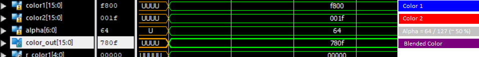

# VHDL Alpha Blender
A simple asynchronous module to blend two color in RGB565 pixel format with a 7 bit alpha value.

Simulation (Alpha = 64 / 127 => ~ 50 %):


It's so easy to use:
```vhdl
entity blender is
	PORT(
		color1 : in STD_LOGIC_VECTOR(15 downto 0); --First Color in RGB565
		color2 : in STD_LOGIC_VECTOR(15 downto 0); --Second Color in RGB565
		alpha : in STD_LOGIC_VECTOR(6 downto 0); --Alpha Value (0 to 127)
		color_out : out STD_LOGIC_VECTOR(15 downto 0) --Output Color
		);
end blender;
```

Number of used Slice LUTs on XC6SLX9 = 232
